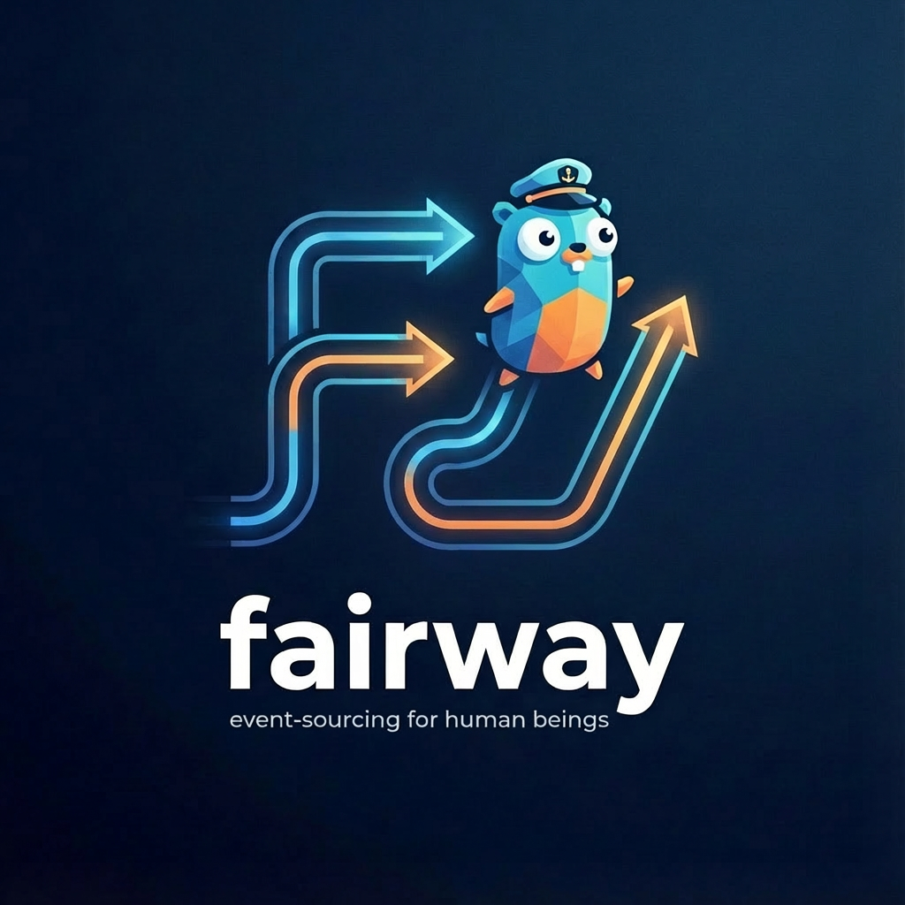

<p align="center">
  
</p>

## What is Fairway?

Fairway is a Go framework for building backends from small, self-contained modules that communicate exclusively through a shared event log. Built on [Dynamic Consistency Boundaries](https://dcb.events) and [FoundationDB](https://www.foundationdb.org).

---

## The Problem

Vertical slicing promises independence but often delivers hidden coupling: shared database tables, one-stream-per-aggregate, or shared domain types force coordination between features.

## The Solution

- **Events as contracts** — modules share only event schemas, never code or storage
- **Dynamic consistency boundaries** — optimistic locking scoped to what a command actually reads, not entire aggregates

---

## Architecture

```
User action          Event log        Projection
    │                    │                │
    ▼                    ▼                ▼
┌──────────┐    ┌──────────────┐    ┌──────────┐
│ Command  │───▶│    Events    │───▶│   View   │
└──────────┘    └──────┬───────┘    └──────────┘
                       │
               ┌───────▼──────┐
               │  Automation  │  (View → Command, no user)
               └──────────────┘
```

---

## Quick Start

**Prerequisites:** Go 1.24+, FoundationDB installed and running.

```bash
git clone https://github.com/err0r500/fairway
cd fairway/examples/todolist
go generate ./...
go run .
```

```bash
curl -X POST http://localhost:8080/api/lists/my-list \
     -H "Content-Type: application/json" \
     -d '{"name": "Shopping"}'

curl http://localhost:8080/api/lists/my-list
```

---

## 📖 Documentation

Full docs, patterns, and examples: **[err0r500.github.io/fairway](https://err0r500.github.io/fairway/)**

---

## Development

FoundationDB must be available to run tests:

```bash
export GOFLAGS="-tags=test"
go test ./...
```
